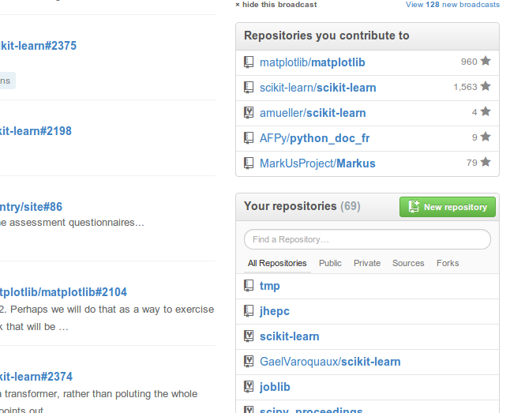
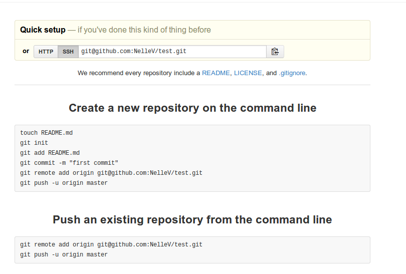
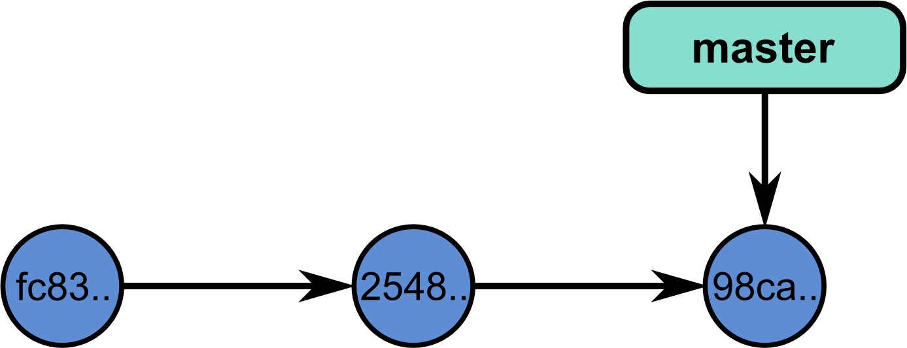
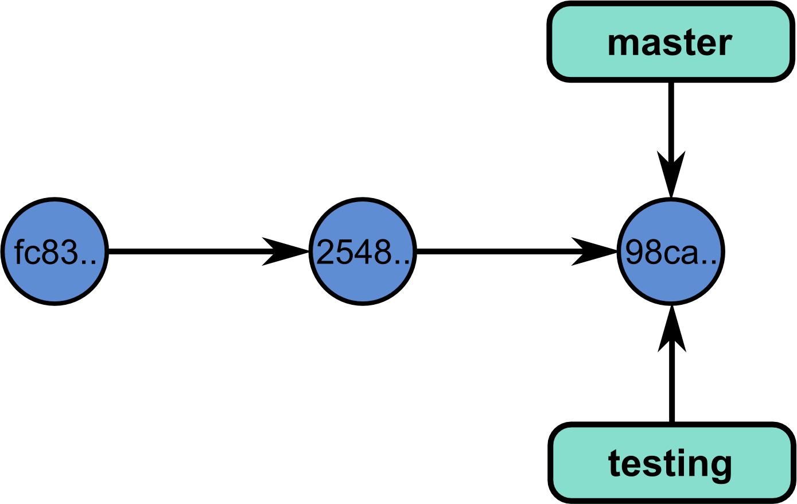
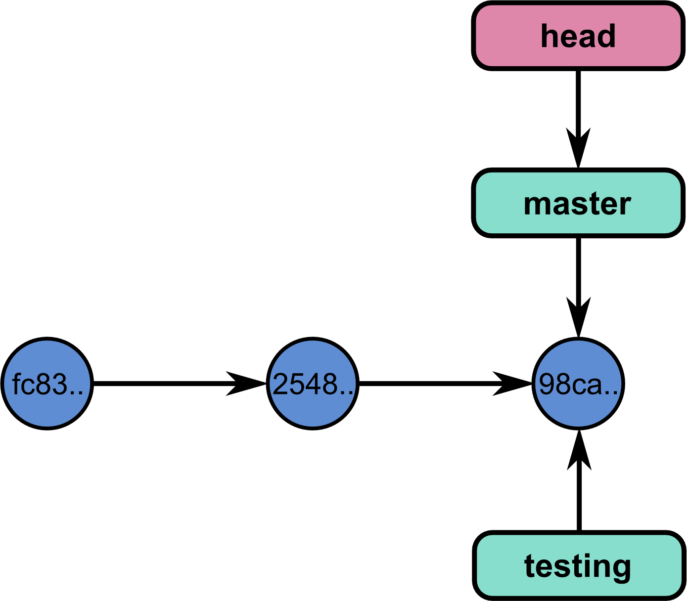
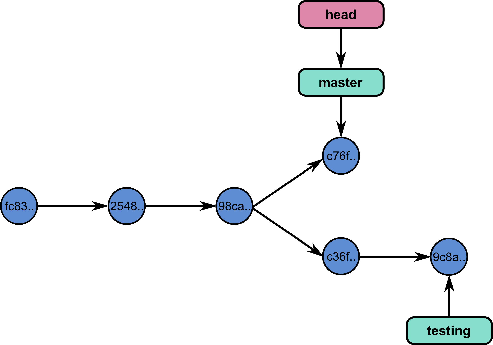

### Version Control

This tutorial was made for EuroScipy‘13. It is aimed at researchers, who
don’t necessarily know version control. Other EuroScipy tutorials
(python based tutorials) can be found [here](http://scipy-lectures.github.io).

### Why do I need version control?

As researchers, you (probably) want:

 -   reproducible research
 -   fast and efficient research

The journal of Irreproducible research.

And ideally, you want to avoid this:

“Piled Higher and Deeper” by Jorge Cham: www.phdcomics.com

Version control systems allow to keep all the historical versions of
your software for easy tracking. It also benefits team collaboration and
mproves our efficiency. In addition, it can be used as a data center,
making build automation and continous integration possible.

In this tutorial, we are going to learn the basics of Git and Github.
First, what is Git? Git is a distributed version control software
(DCSV). Github is a git hosting platform that provide free git
repository for all opensource softwares. Other well-known DCVS are
mercurial and bazaar, with their respective hosting platform, bitbucket
(which now also supports git repository) and launchpad.

Why did we choose to introduce git, and not mercurial, which is not only
build with python, but has also been chosen by CPython (and many other
python project) to host their code. That decision was quite
straightforward: in the scientific world, git (and github) are much more
widely used than mercurial (and bitbucket). A scholar.google search
yields 14,100 results for a “github” search, while a “bitbucket” search
only returns 2,260 results. 

Before we start learning git, please be aware that git is a very
powerful tool. We will only introduce the basics of Git in this
tutorial, and many things may seem obscure and you may (will?) struggle
with the concepts. Yet, after a while using it, we get used to the rough
edge, and start using more complex commands.

The basic git workflow is:

 -   modify files in your working directory.
 -   stage files you’ve worked on. This prepares a snapshot of the
     directory
 -   commit the files you’ve staged. This stores that snapshot in the
     Git repository.

### Initializing repositories and configuring git

There are several way to initiliaze a git repository. The first is used
to initialize git in an existing repository. The second is used to
retrieve an existing repository.

To initialize a new project, in the project directory, initialize the
git repository with:

    git init

This will enable git to keep track of changes in this folder, and
subfolders by creating a .git hidden folder containing the git skeleton.

The second way is:

    git clone https://github.com/git-lectures/git-lecture-notes.git

This will clone the repository containing the documents of this
tutorial.

Each new repository should be in its own directory. One git repository
should not be created or cloned in an existing git repository, ie a
folder you’ve initialized a git repository and its subfolders.

Before continuing let’s configure git. You will have to do this once per
computer you use `git config --global`:

    git config --global user.name "Your Name Comes Here"
    git config --global user.email you@yourdomain.com``
    git config --global core.editor vim
    git config color.ui auto

The `--global` option corresponds to a user-wide
configuration. The configuration will be stored in a hidden repository
in your home. You can also configure each git repository individually,
by removing this option, or system-wide by replacing the
`--global` option with `--system`. Usually, we just configure repositories user-wide.

You can check your configuration with:

    git config --list

If you’ve configured git several times at different levels, you will
probably see several entries twice or three times in the configuration
list. The user-wide configuration overrides the system-wide
configuration, and the local configuration overrides the user-wide
configuration.

###Working locally

One of the main goal of version control is to save snapshots of your
directory. We call those snapshots commits. To each snapshot is
associated some metadata: the date the snapshot was taken, who took it,
what files where modified, the changes that were made on those files
etc. Git will enable you to track the changes made to the files, revert
the entire project to a previous snapshot, review changes made over
time, view who modified a file.

Now that we know why we want to create a snapshot, let’s see how to do
this. Right now, nothing in the project is tracked. First let’s create
some directories and files in our directory.

    touch README

You now have a new file in the project folder. As mentioned before, git
does not track this file yet. First, you need to tell git this file
exists:

    git add README

Now you can commit it:

    git commit -m "Added a README file"

At this point, you have one tracked file, and an initial commit. Each
file in the working directory can be in one of two states: tracked or
untracked. Any file you have not explicitly added at some point is
untracked. Tracked files can themselves be in different states:
unmodified, modified or staged.

You can check the status of each file in your directory with the command
`git status`. This command will display all
untracked files, and modified and staged files in your directory:

    touch AUTHORS
    git status

Note as the README file is not listed, while the AUTHORS file is there.
Now let’s add the AUTHORS file. The AUTHORS file is now tracked, and
staged:

    git add AUTHORS
    git status

`git add` is also used to stage file. In fact,
running `git add` on an untracked file not only
tracks it, but stages it. `git commit` will take a
snapshot of the staged files:

    git commit -m "Added the AUTHORS file"

And here is the second commit! Sometimes, you may want to look at the
changes you’ve made to a modified file:

    git diff

To look at the changes you’ve made in the staged files, simply use:

    git diff --cached

And to view the history of all commits:

    git log

Now, let’s try to rm AUTHORS:

    rm AUTHORS CONTRIBUTORS
    git status

You can see that the `AUTHORS` file is in red, and
marked as deleted. Yet, running `git add` on this
file doesn’t move the change in the staging area. To remove a file that
has been tracked with git, use the `git rm` command.
In a similar fashion, `git mv` can be used to move a
file.

Because to err is human, you may want to cancel some stages. Two
scenarios may occur: (1) you have staged a file you do not want to
commit (2) you have made some changes on a file you want to cancel.

First, let’s assume you’ve staged a file you want to unstage:

    touch TODO
    git add TODO

To unstage it, run:

    git reset HEAD TODO

The syntax is `git reset HEAD <filename>`. We will
explain what HEAD is later on.

In the second case, you’ve modified a file and you want to cancel the
changes. To do so, use `git checkout <filename>`. If
you run `git status`, you can notice git reminds you
what command to use for which action.

### Exercises

 -   Create a folder called GitTutorial
 -   Inside it, initialize an empty git repository
     (`git init`)
 -   Create an AUTHORS file, a TODO file and a README file.
 -   Add the AUTHORS file to the staging area. (`git add`{.docutils
     .literal})
 -   Check the status of the repository (`git status`{.docutils
     .literal})
 -   Add the two other files to the staging area (`git add`{.docutils
     .literal})
 -   Commit your changes (`git commit`).
 -   Now rename the AUTHORS file to CONTRIBUTORS (`git mv`{.docutils
     .literal}) and commit.
 -   Add your name to the CONTRIBUTORS file.
 -   Cancel the changes you’ve made to this file. Tips: look at what
     `git status` tells you to do.
 -   Create a `src` directory, and add a python
     script that prints the first 10 integers of the Fibonacci suite.
     Add and commit this script.
 -   Remove this file using `git rm` (but don’t
     commit it).
 -   Try cancelling those changes. What’s happening?

### Working with a distant repository with github

Up to now, we’ve been working locally on our computer. As researched and
computer scientist, you may want to share your work, (or better
contribute to an opensource project!). This is where github comes in
handy. Github is a web hosting plateform for git projects. Not only does
it provide free git repository for opensource projects (private ones can
be purchased, or asked for free for students and women), but it provides
great tools to review code, manage projects, release packages and
publish documentation. Most of the scientific python code **you** use
are hosted on github.

Now, let’s go on github, and create an account. Once this is done, we
can easily create a new project by cliking on the green button, on the
main page.

Github redirects you to a page, where you specify the name of the
repository and a few information. By default, git repositories hosted on
github will be public. If you want private repositories, you either have
to pay 7\$ per months. If you are in academics, you can
also ask for free private repositories:  [Github for academics](https://github.com/edu).

Github then displays a page with a url, and some information on how to
proceed to configure your local repository. Note that if you decide to
create a README file, a Licence or a .gitignore on github, it will
automatically commit.

To use this new git repository, we are going to associate to this url a
name. To add a new remote Git repository as a shortname you can
reference easily, run `git remote add <shortname> <url>`:

    git remote add origin <github_url>

The \<github\_url\> can be new referenced as origin. To check which
remotes you’ve added, run:

    git remote

or:

    git remote -v

Now that you’ve added this shortcut, you can push new changes to the
remotes:

    git push origin master

And now, checkout your github repository !

You can also fetch changes from a github repository:

    git fetch origin

This will fetch all the changes of all branches from the remote (we will
see branches later one). Yet, it will not merge those changes with your
work.

Sometimes, you may want to rename or remove a remote. To do so, run
`git remote rename <old_remote_name> <new_remote_name>` and `git remote rm <remote_name>`.

### Branching and merging

To understand what a branch is, let’s first go back to what a commit is.
A commit is a snapshot of a repository at a certain time. Each commit
contains metadata: a hash to identify the commit, the author name, date
etc. It also contains a link to the parent commit. Hence, committing
creates a sort of linked list of commits.

A branch is just a pointer to a commit:

In fact, you’ve been using a branch called master since the beginning.
Creating a new branch just adds a pointer to a commit:

Let’s now create a new branch and call it `testing`.
You can either use the commands:

    git branch testing

Now, how does github know in which branch you are? It just creates a
pointer called HEAD to the current working branch:

You can check which branch you created by running:

    git branch

The branch in green marked with an asterix is the branch you are
currently working on. To switch branch, run:

    git checkout testing

You can create and change branch in a one-liner:

    git checkout -b testing

If you add commits on both `master` and
`testing`, the code can diverge:

Now let’s add a new commit:

    vim AUTHORS
    git add AUTHORS
    git status
    git commit -m "Added a new author"

You’ve now created a new commit in branch `testing`.
You can easily go back to the master branch by running:

    git checkout master

Checking out a branch will restore the tracked files to the state they
were at the last commit you created on the branch you are going back to.
Note that if you have uncommitted or staged changes, git will not permit
to switch branches.

To incorporate the changes of the branch `testing`
into `master`, you need to merge `testing` in master. To do so, make sure you are in branch master (using
`git branch`), and run the following command:

    git merge testing

You can use git log to check that the changes have been merged into
master. Once a branch has been merged, you can delete it:

    git branch -d testing

Remember how, in the previous section, we discussed how to fetch changes
from a remote repository using `git fetch`? We also
said fetching the changes did not incorporate them into your working
repository. So what does it do... Git fetch updates a series of branch
from a remote, let say `origin`, by creating and
updating remote branches called `origin/branch_name`. If you wan to update your branch `master`
with the changes you’ve pulled into `origin/master`,
you need to merge `origin/master` onto
`master`:

    git merge origin/master

You can checkout the remote branches, but you should never (never ever
ever!!!) work in those branches.

### Exercises

 -   Create a github account.
 -   Create a git project. **Do not add a readme file, a .gitignore
     file, or anything thing to this project through the github
     interface**. This would create a commit and be quite annoying for
     the rest of the exercise.
 -   Add a remote called origin to your local git repository
     (`git remote add`). Note that github tells you
     how to do this.
 -   Push your changes to the remote (`git push`)
     and check your changes do appear on Github.
 -   Now create a branch called `fix`. Edit the
     README file (add a title to it), add it to the staging area and
     commit it.
 -   Push this branch on the github repository::
     `git push origin fix`. This branch should
     appear in the github interface.
 -   Now merge the changes back to your master branch.
